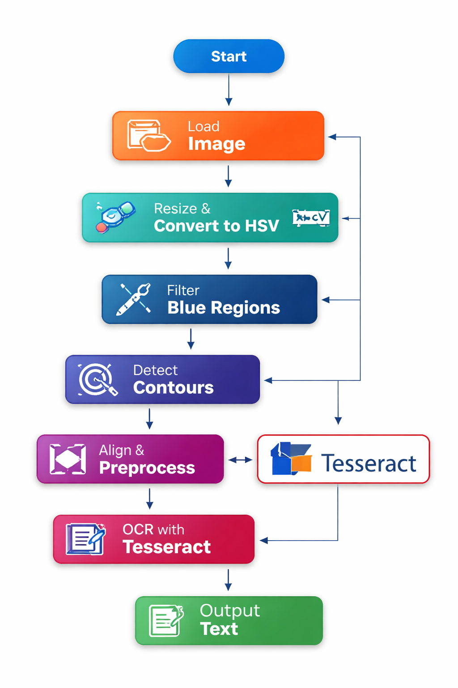

# Progetto di Riconoscimento Targa con OpenCV e Tesseract

Questo progetto utilizza **OpenCV** e **Tesseract** per eseguire il riconoscimento delle targhe su immagini. Il flusso principale include il caricamento dell'immagine, il filtraggio del colore per identificare i rettangoli blu (targa), l'elaborazione dell'immagine e infine il riconoscimento del testo tramite OCR.

## Tecnologie Utilizzate

- **OpenCV**: Libreria per l'elaborazione delle immagini.
- **Tesseract**: Motore OCR per il riconoscimento del testo.
- **C#**: Linguaggio di programmazione utilizzato per il progetto.

## Funzionamento

1. **Caricamento e Ridimensionamento dell'Immagine**  
   L'immagine viene caricata e ridimensionata per facilitarne il trattamento.

2. **Conversione da BGR a HSV**  
   Viene cambiato il formato di colore dell'immagine da BGR a HSV per facilitare il riconoscimento della targa (rettangolo blu).

3. **Filtraggio del Colore**  
   Viene eseguito un thresholding per isolare il colore blu e rendere l'immagine in bianco e nero, facilitando il rilevamento dei contorni.

4. **Rilevamento dei Contorni**  
   Vengono trovati i contorni delle regioni bianche nell'immagine.

5. **Selezione e Separazione delle ROI (Region of Interest)**  
   Vengono identificati i rettangoli a sinistra e a destra della targa, quindi viene selezionata la zona centrale tra questi due rettangoli.

6. **Rotazione dell'Immagine**  
   L'immagine viene ruotata per allineare la targa orizzontalmente.

7. **Pre-elaborazione per OCR**  
   L'immagine viene convertita in scala di grigi e vengono applicati thresholding e operazioni di morfologia per rimuovere il rumore.

8. **Riconoscimento del Testo (OCR)**  
   L'immagine pre-elaborata viene passata a **Tesseract** per il riconoscimento del testo (targa).

9. **Salvataggio del Risultato**  
   L'immagine elaborata viene salvata in formato PNG, e il testo riconosciuto viene stampato a schermo insieme alla sua precisione.
   
## Diagramma del flusso


## Requisiti

- **.NET Core o .NET Framework** per eseguire il codice.
- **OpenCVSharp**: La libreria OpenCV per .NET.
- **Tesseract OCR**: Per il riconoscimento del testo.
- **Tessdata**: I file di dati di Tesseract per il riconoscimento della lingua italiana e inglese.

## Istruzioni per l'Uso

1. **Clonare il Repository**:
   ```bash
   git clone https://github.com/tuo-username/progetto-targa.git
   cd progetto-targa
